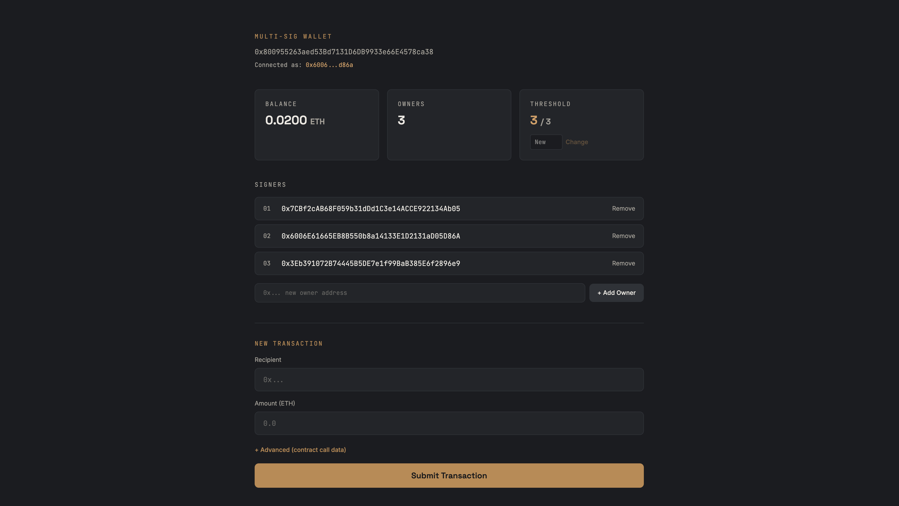

# Multi-Sig Wallet

A production-style multi-signature wallet built with Foundry and React. Supports ETH transfers and arbitrary contract calls, with self-governed owner management, transaction cancellation, and a full audit trail.

**Live demo:** _(https://multi-sig-wallet-foundry.netlify.app/)_
**Contract (Sepolia):** _(https://sepolia.etherscan.io/address/0x800955263aed53Bd7131D6DB9933e66E4578ca38)_


---

## Overview

A multi-signature wallet requires multiple owners to approve a transaction before it executes — no single owner can move funds alone. This project implements the full lifecycle: propose, confirm, execute, revoke, and cancel, plus self-governed owner and threshold management (adding/removing owners and changing the confirmation threshold all go through the same multisig approval flow as any other transaction).

## Architecture

**Smart Contract (`MultiSigWallet.sol`)**
- Universal execution via low-level `.call()` — supports plain ETH transfers and arbitrary contract calls (function selector + encoded args)
- Self-governance pattern: `addOwner`, `removeOwner`, and `changeThreshold` are only callable by the contract itself (`onlySelf`), meaning they must go through the same submit → confirm → execute flow as any other transaction
- Transaction cancellation: the original submitter can cancel a pending transaction directly, or the current owners can cancel any pending transaction through the multisig flow
- Checks-Effects-Interactions pattern throughout to prevent reentrancy
- Gas-optimized modifiers (logic extracted to internal functions per Foundry lint recommendations)

**Frontend (React + TypeScript + Vite + ethers.js v6)**
- `/create` — deploy a new wallet by specifying owners and confirmation threshold
- `/wallet/:address` — dashboard for submitting, confirming, executing, revoking, and cancelling transactions, plus owner/threshold management
- Real-time updates via contract event listeners (no manual refresh needed)
- Human-readable transaction descriptions (decoded from raw calldata)

## Security

This contract went through a self-audit process during development. One notable finding:

**Stale confirmation vulnerability.** The contract originally trusted a cached `numConfirmations` counter when deciding whether a transaction had enough approvals to execute. If an owner confirmed a transaction and was later removed, their confirmation remained counted — meaning a transaction could execute with fewer *current* owners' approval than the threshold required. This was caught with a proof-of-concept test that confirmed a transaction, removed the confirming owner, then showed the transaction could still execute.

**Fix:** `executeTransaction` now recomputes valid confirmations at execution time by iterating over the *current* owner list (`_countValidConfirmations`), rather than trusting the stored counter. This bounds the loop to the (small, owner-governed) list of owners rather than the unbounded transaction history, avoiding a gas-limit DoS while closing the vulnerability.

Other protections:
- Zero-address guard on transaction recipients
- Owner-removal guard preventing the owner count from dropping below the confirmation threshold (which would permanently lock the wallet)
- Transactions cannot be confirmed, executed, or cancelled more than once, or after execution/cancellation

## Tech Stack

| | |
|---|---|
| Contracts | Solidity, Foundry (forge, cast) |
| Frontend | React, TypeScript, Vite, ethers.js v6, Tailwind CSS v4 |
| Testing | Foundry test suite (32 tests) |
| Deployment | Sepolia testnet, Netlify |

## Running locally

**Contracts**
```bash
forge install
forge build
forge test -vvv
```

**Frontend**
```bash
cd multisig-wallet-frontend
npm install
npm run dev
```

Copy the compiled ABI after any contract change:
```bash
cp out/MultiSigWallet.sol/MultiSigWallet.json multisig-wallet-frontend/src/contracts/MultiSigWallet.json
```

## Test coverage

32 tests covering constructor validation, the full submit/confirm/execute/revoke/cancel lifecycle, `onlySelf` protection, self-governance flows, the stale-confirmation fix, and edge cases (double confirmation, insufficient confirmations, owner-removal threshold guard, zero-address recipients).

```bash
forge test -vvv
```

## License

MIT